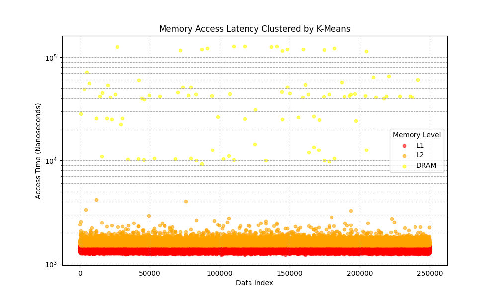

# Analysis Of Memory Latency: Analyzing How Cache Memory Reduces Data Latency

Cache memory is absolutely vital to fast memory access time, and it is sometimes forgotten about.
Without cache memory, programs would be much slower which ultimately would allow them to do less.
This project intends to prove that cache memory leads to much faster load times of data and reduces latency.

## System Setup
The simulation for seeing how cache memory reduces memory latency will be done on a
32-Bit Arm [Zybo Z7-10](https://digilent.com/shop/zybo-z7-zynq-7000-arm-fpga-soc-development-board/?srsltid=AfmBOoqz20wMKV8HNT29yTQF-nAS93xgotJf4j4MvdcL81MAA83D6rhD). This board has the following:

- 32KB L1 Cache per core
- 512KB L2 Cache shared
- 1 GB DDR3L Main Memory (DRAM)
- Petalinux v1 with the Linux kernel v6.12.10

## Methodology
The test will be done using an array of memory; we will probe parts of the array
randomly, tracking each access time in nanoseconds.

With the principle of locality, as more data is called into cache memory, the accesses should overall
be faster.

The array will be sizable such that it cannot fit into cache memory alone so that we can see the difference
between DRAM and cache. The size will be 1MB (1,000KB). This is:

    N Items: 1,000,000 / sizeof(int)

We will access N items randomly, roughly 250,000. We expect that more than half of the accesses should be within L1 cache and barely any accesses should be in DRAM due to the principle of locality.

## Execution
On the Zybo Z7 10, we use `gcc` to compile and run the test:
```bash
gcc main-arm32.c
./a.out
````

A csv file, `output.csv`, will be generated. This can be viewed on `matplotlib` with `python`:

```bash
python3 generate-scatterplot.py
```

## Results

A graph is generated to view the results of the test.



The data aggregates to the smallest nanoseconds (10^3). Now accessing cache memory is usually much faster, \~6ns, but accounting for system call overhead, it adds to the time.

## Data Analysis

The aggregation of the memory access times leads to 3 groups being clearly defined. We can see how much more data accesses happen in L1 and L2 memory compared to DRAM memory. If more data accesses were in DRAM, then memory access times would be on average 100 times slower, which would make programs overall much slower.

Not visible in this graph, but more data accesses will lead to more memory in cache, which also contributes to faster access times.

## Conclusion

Even though cache memory and physical memory as a whole is abstracted away from systems, it can be found if you try hard enough. Cache in systems is getting more and more important as systems perform more and more tasks.

More graphs can be created with this data. One in particular would be seeing as the simulation runs, data access times become faster, proving the principle of locality. Since data is closer to the processor, latency is overall reduced.
